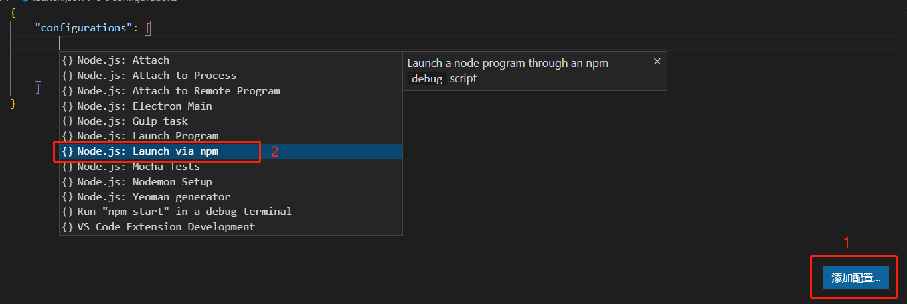
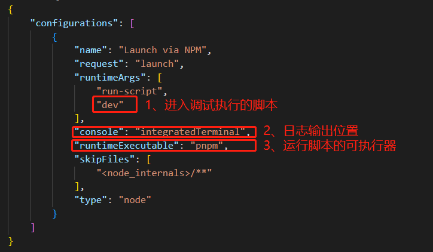
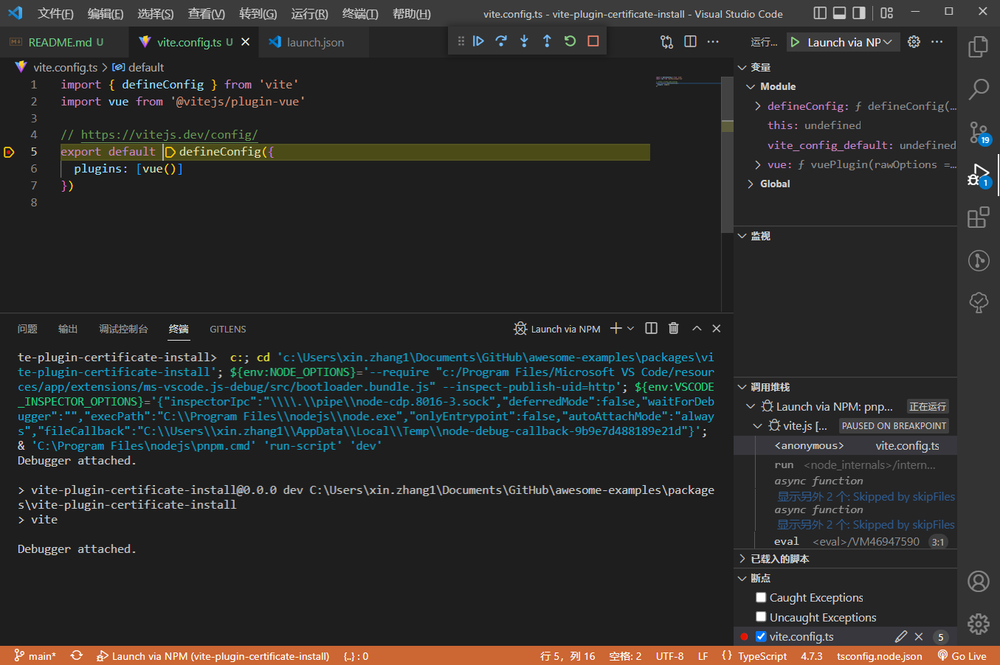
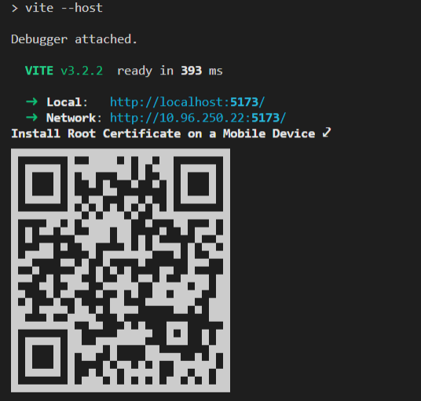

## 添加支持调试`vite`的环境配置：

1. 在项目根目录创建名为`.vscode/launch.json`调试环境配置文件；

2. 在调试窗口右下角点击添加配置，并选择 `Node.js：Launch via NPM`；


3. 调整增加的 `Launch via NPM` 配置以适合当前项目： 


4. 在`vite.config.ts`的起始位置打断点后通过调试窗口运行 `Launch via NPM` 配置，运行成功后将停留的目标断点处；



## 添加`Vite`插件模板及基本配置：

1. 在项目根目录增加名为`plugins/vite-plugin-certificate-install.ts`的插件文件；
```typescript
import type { Plugin, ResolvedConfig, ViteDevServer } from "vite";

const certificateInstall = () => {

    let config: ResolvedConfig;

    return {
        // 1、指定插件名称
        name: 'vite-plugin-certificate-install',
        // 2、指定插件在serve时运行，默认serve和build均运行
        apply(_, { command }) {
            return command === 'serve'
        },
        // 3、存储最终解析的配置
        configResolved(_config) {
            config = _config
        },
        // 4、配置开发服务器钩子
        configureServer(server: ViteDevServer) {
            server.middlewares.use((req, res, next) => {

            })
        },
    } as Plugin;
}

export default certificateInstall;
```

2. 安装插件到`vite.config.ts`，ts环境受`tsconfig.json`文件限制，可能需要将编写的脚本显示的添加到`include`配置中：
```typescript
import { defineConfig } from 'vite'
import vue from '@vitejs/plugin-vue'

// 1、导入插件
import certificateInstall from './plugins/vite-plugin-certificate-install';

export default defineConfig({
    plugins: [
        vue(),
        // 2、安装插件 
        certificateInstall()
    ]
})
```

## 编写开发服务器中间件

说明：

> 证书文件受浏览器影响直接访问可能至会渲染出证书内容而不能触发移动设备安装。
    
> 只获取`resolvedUrls`中的`network`选项是因为移动设备通过统一网络进行获取，`local`地址将无法在移动设备直接访问，所以`local`兼容无意义；


1. 重写printUrls函数，扩展其支持输出安装证书的二维码；

```ts
server.middlewares.use((req, res, next) => {
    const { method, originalUrl } = req;
    if (method === 'GET' && originalUrl === '/__certificate/') {
        const pemPath = path.resolve(_path, _pem);
        if (!fs.existsSync(pemPath)) throw new Error(`Make sure that '${pemPath}' exists.`);
        const pem = fs.readFileSync(path.resolve(_path, _pem));
        res.writeHead(200, {
            'Content-Type': 'application/octet-stream',
            'Content-Disposition': `filename=${_pem}`,
        })
        res.end(pem);
    } else {
        next();
    }
})
```

2. 拦截执行的安装证书请求，并读取证书文件后写回移动设备；

```ts
// 保存一份内置的printUrls函数；
const _print = server.printUrls;
// 重写printUrls函数，扩展功能；
server.printUrls = () => {
    _print();
    // 获取 network 中的地址用于合成url后生成二维码
    const host = server.resolvedUrls?.network[0];
    if (host) {
        console.log(`${bold('Install Root Certificate on a Mobile Device ⤦')}`);
        qrcode.generate(`${host}__certificate/`, { small: true });
    } else {
        console.log(`${green('Failed to get the network address.')}`);
    }
}
```



## 插件打包

在插件打包时我们还是要考虑到使用者非TypeScript开发环境，所以需要转为JavaScript后进行分发，`tsup`模块利用esbuild在不需要任何配置的情况下就可以对Ts进行编译。

需要在项目中安装`tsup`到开发依赖，请不要直接通过`npx`使用，可能会因为找不到`typescript`模块而终止掉部分编译流程；

安装后使用如下命令编译插件，需要指定入口文件、出口目录、编译.d.ts文件、输出模块类型选项：

```sh
tsup ./plugins/vite-plugin-certificate-install.ts --outDir output --dts --format cjs,esm
```